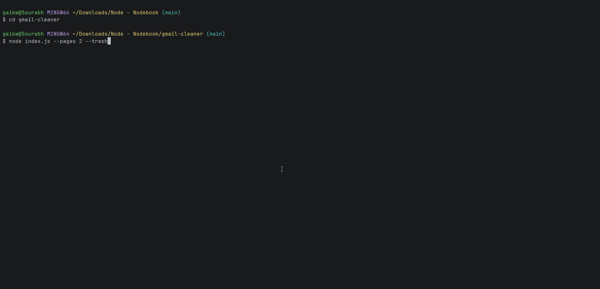

# gmail-cleaner
A CLI tool to Gmail inbox. Headless Gmail Aggregator & Cleaner


*A high-performance, concurrent CLI tool built in Node.js to safely aggregate, parse, and batch-process large volumes of Gmail data via the Google REST API.*

---

## System Architecture & Design

This isn't just a simple script; it's a headless data processing pipeline designed for performance and stability. The application follows a **Composition Root** pattern in `index.js`, which is responsible for parsing CLI arguments, setting up dependencies (like the authenticated `gmailInstance`), and routing to the appropriate controller.

The core logic uses a **Batch Aggregation** architecture:

1.  **Stage 1: Aggregation (Concurrent):** The tool first paginates through the Gmail API to collect all the necessary message metadata into memory. This phase is heavily parallelized to maximize speed.
2.  **Stage 2: Processing (In-Memory):** Once all data is collected, it is processed *in-memory*—shaping, sorting, and filtering the data without making further network requests.
3.  **Stage 3: Execution (Batch):** The final, prepared list of message IDs is sent to the Gmail API in a single batch modification request for maximum efficiency.

This separation ensures that network latency is handled in one focused stage, and data processing is done at native V8 engine speeds.

## Technical Challenges Conquered

This project solved several common-but-complex backend engineering challenges:

- **Concurrency & API Rate Limiting:** To avoid performance bottlenecks from sequential fetching, this tool processes email metadata in parallel. A naive `Promise.all()` was not an option, as it would immediately trigger Google's `429 Too Many Requests` error. Instead, the application uses **`p-limit`** to manage a strict concurrency pool, guaranteeing that no more than 20 requests are in-flight at any time. This prevents API errors and ensures high-throughput data fetching without compromising system stability.

- **Production-Grade Telemetry:** Simple `console.log` statements are insufficient. This tool implements a robust, production-ready logging pipeline using **`pino`**. It generates structured NDJSON logs separated by level (`info`, `debug`, `error`) for machine-readability, while providing a colorized, human-readable stream for developers via **`pino-pretty`** when in debug mode (`--dev`).

- **Memory Management & Pagination:** The application safely handles large mailboxes by paginating through the Gmail API's list endpoint using `pageToken`. This ensures a predictable and stable memory footprint, regardless of the size of the user's inbox.

- **Secure Authentication & Token Management:** The application implements the full server-side Google OAuth2 flow using the `googleapis` library. It programmatically generates authentication URLs, handles the token exchange, and securely stores refresh tokens locally in `tokens.json` for persistent sessions, avoiding the need for the user to log in on every run.

## Tech Stack

*   **Runtime:** Node.js (v20+)
*   **Core Libraries:**
    *   `googleapis` & `@google-cloud/local-auth` for Google API Authentication
    *   `commander` for robust CLI argument parsing
    *   `p-limit` for concurrency throttling
    *   `pino` & `pino-pretty` for structured logging
*   **CLI UI:**
    *   `ora` for interactive loading spinners
    *   `chalk` for terminal styling
*   **Configuration:**
    *   `dotenv` for environment variable management

## Getting Started

### 1. Prerequisites

*   Node.js v20.0.0 or higher
*   NPM
*   A Google Cloud Platform account

### 2. Initial Setup

1.  **Clone the repository:**
    ```bash
    git clone https://github.com/bitparanoid27/gmail-cleaner.git
    cd gmail-cleaner
    ```

2.  **Install dependencies:**
    ```bash
    npm install @google-cloud/local-auth, googleapis, p-limit, commander, dotenv, pino, pino-pretty 
    ```

### 3. Google Cloud API Credentials

This tool requires access to the Gmail API.

1.  Go to the [Google Cloud Console](https://console.cloud.google.com/).
2.  Create a new project.
3.  Enable the **Gmail API** for that project.
4.  Go to "Credentials", click "Create Credentials", and choose "OAuth client ID".
5.  Select "Desktop app" as the application type.
6.  Once created, download the JSON file.
7.  Rename the downloaded file to **`credentials.json`** and place it in the **root directory** of this project.

### 4. First Run & Authentication

On your first run, the application will open a browser window and ask you to log in to your Google account to grant permission.

```bash
node index.js --unsub
```
After you approve, the app will generate a tokens.json file in the project root. You will now be logged in for all future runs.

##### Usage
The application is controlled via node scripts you can NPM scripts for more simplified user experience.

###### To Unsubscribe from Mass Mailers:

```
Bash
Scan the default 1 page
node index.js --unsub
```
```
Scan 5 pages
node index.js --pages 5 --unsub

--> `replace 5 with a different number of pages to scan`
```

##### To trash Mass Mailers:
```
Bash
Scan the default 1 page
node index.js --trash
```
```
Scan 5 pages
node index.js --pages 5 --trash

--> `replace 5 with a different number of pages to scan`
```

##### Developer / Debug Mode:
To see the detailed Pino logs in the terminal instead of the UI spinners, use the dev scripts.
```
Bash
node index.js --pages 3 --unsub --dev | npx pino-pretty
```

## More features will be added to project. 
This project is still work in progress. 
